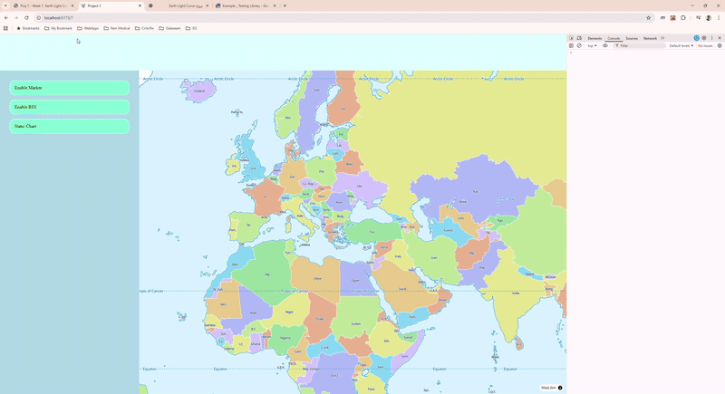

# LeafSense

## Pitch 

This application allows users to explore Sentinel-2 L2A imagery, compute NDVI (Normalized Difference Vegetation Index) for selected AOIs, visualize time-series, detect change points, and export results for analysis. Useful for environmental monitoring, agriculture, and research.

---
## Methods

This application uses STAC items and Cloud-Optimized GeoTIFFs (COGs).

For each scene:
- Red (B04) and NIR (B08) bands are read from GeoTIFFs.
- NDVI is computed per pixel using the formula:  
  NDVI = (NIR − Red) / (NIR + Red)
- Scene Classification Layer (SCL) is used to mask clouds, shadows, water, and invalid pixels.
- NDVI is aggregated over a point or polygon (zonal) using mean or median.
- Scenes below a minimum valid-pixel coverage threshold are excluded.
- Optional outlier rejection (IQR or z-score) and rolling-median smoothing can be applied.
- Results are assembled into a chronological time series and visualized.

---
## Features
- NDVI computation (point & zonal)
- Masking clouds/shadows (SCL)
- Rolling median smoothing
- Outlier rejection (IQR & z-score)
- Change-point detection
- Interactive chart with brush/zoom and annotations
- Export CSV & PNG
- Provenance panel showing included/excluded scenes

---
## Parameters

The following parameters control data selection, filtering, and visualization:

- **AOI (Area of Interest)**: Point or polygon selected on the map.
- **Date range**: Start and end dates for STAC search.
- **Max cloud cover (%)**: Pre-filter scenes using STAC cloud cover metadata.
- **Coverage threshold (%)**: Minimum fraction of valid pixels required per scene.
- **Mode**: Point or zonal (polygon) sampling.
- **Aggregation**: Mean or median NDVI.
- **Outlier filter**: On/off (IQR or z-score based).
- **Smoothing window**: Rolling median window size (1 disables smoothing).
- **Change-point detection**: Enable/disable with sensitivity controls.

All parameters are persisted in the URL so the view can be restored via copy/paste.

---
## Quickstart

```bash
git clone <repo>
cd leafSense
npm install
npm run dev
```
---
## Scripts

| Command | Description |
|----------|--------------|
| `npm run dev` | Start development server |
| `npm run build` | Build project for production |
| `npm run preview` | Preview production build locally |
| `npm run lint` | Run ESLint |
| `npm run format` | Run Prettier formatting |
| `npm run typecheck` | TypeScript type checking |
| `npm run test` | Run unit tests (Jest) |
| `npm run e2e` | Run end-to-end tests (Playwright) |

---
## How it Works

The application follows a clear processing pipeline from raw satellite data to interactive analysis:

STAC items  
→ NDVI computation (point or zonal)  
→ Cloud & shadow masking (SCL)  
→ Coverage & quality filtering  
→ Time-series assembly (sorted by date)  
→ Optional smoothing & outlier rejection  
→ Change-point detection  
→ Interactive chart, provenance, and export

---
## Data Sources & Licenses

This project uses open satellite data and open standards:

- **Sentinel-2 Level-2A**  
  Source: Microsoft Planetary Computer
  Usage: Surface reflectance bands (Red, NIR) and Scene Classification Layer (SCL)  
  License: Copernicus Open Access Licence

- **STAC APIs**  
  Used for discovery, filtering, pagination, and metadata access  
  Standard: https://stacspec.org

- **MapLibre GL JS**  
  Used for interactive map rendering and AOI selection  
  License: BSD-3-Clause

All data is processed on-the-fly; no satellite imagery is redistributed or stored long-term.

---
## Limitations

- GeoTIFFs may use projected coordinate systems (e.g. UTM); map coordinates must be
  reprojected before pixel sampling.
- Zonal results depend on raster resolution (10 m vs 20 m); up/down-sampling can affect precision.
- Aggressive cloud masking or high coverage thresholds may remove many scenes.
- Outlier detection assumes reasonable temporal continuity and may misclassify abrupt but real changes.
- Client-side processing performance depends on AOI size and number of scenes.

---
## Masking Details

Cloud, shadow, and quality masking rules are documented separately.  
See: [`docs/data/masking.md`](docs/data/masking.md)

---
## Roadmap

Planned improvements and extensions:

- Use Copernicus `/process` endpoint for server-side computation
- Improved mobile UX and accessibility
- Improve Core Web Vitals (LCP, INP, CLS)
- History of server-side requests and computations

---
## Folder Structure

```js

/src
    /assets
    /components
    /hooks
    /lib
    /store
    /types
    /utils
/public
/tests
/e2e
/docs

```
---
## CI/CD
This repository uses **GitHub Actions** to automatically:
1. Install dependencies  
2. Run lint and unit/E2E tests  
3. Build the project  
4. Deploy when merged into `master`

---
## Tech Stack

- TypeScript  
- React  
- ESLint + Prettier  
- Jest + Playwright  
- GitHub Actions CI/CD  

---
## In-Memory Cache Documentation

This document describes the in-memory caching mechanisms used in the application.

### 1. Cache STAC Items

**Purpose:**  
Cache STAC (SpatioTemporal Asset Catalog) items to reduce repeated queries and improve performance.

**Cache Key:**  
The key for this cache is based on the **search parameters used to query STAC items**.  

### 2. Cache NDVI Calculations

**Purpose:**  
Cache NDVI (Normalized Difference Vegetation Index) calculation results to avoid redundant processing.

**Cache Key:**  
The key for this cache is based on:  
1. `item_id` – Unique identifier of the STAC item.  
2. `NDVI coverage threshold` – The threshold used for NDVI calculation.  
3. `Rejection Outlier type` – The type of outlier rejection applied.  


**Notes:**  
- Both caches are **in-memory** and are not persisted between application restarts.  
- Key composition must be consistent to avoid cache misses.  
- Consider cache size limits or eviction policies if memory usage is a concern.

---
## Privacy Note

- This app does **not collect personal user data**.  
- No analytics or tracking is implemented.  
- All user interactions remain local to the app. 

---
## Demo



---
## Citation & Attribution

### Data Sources

This project uses **Sentinel-2 Level-2A surface reflectance data** provided by the  
**Copernicus Programme** and accessed via the **Microsoft Planetary Computer** STAC API.

© European Union, Copernicus Sentinel-2 data (2015–present).  
Accessed through Microsoft Planetary Computer.

- Source: Copernicus Sentinel-2
- Access platform: Microsoft Planetary Computer
- Data license: Copernicus Open Access Licence  


### Software & Libraries

This project is built using the following open-source libraries:

- **MapLibre GL JS** – interactive map rendering  
- **GeoTIFF.js** – reading Cloud-Optimized GeoTIFF (COG) raster data  
- **Proj4js** – coordinate reprojection between EPSG systems  
- **Recharts** – time-series visualization and charting  
- **React** – user interface framework  
- **Turf.js** – geometric utilities (ROI construction)

All libraries are used in accordance with their respective open-source licenses.

---

### How to Cite This Project

If you use this tool, its results, or derived visualizations in research, reports, or publications, please cite:

Almer, Alireza. *LeafSense: NDVI Time-Series Explorer*. Version v1.0.0.  
Available at: https://leaf-sense-web.vercel.app/

